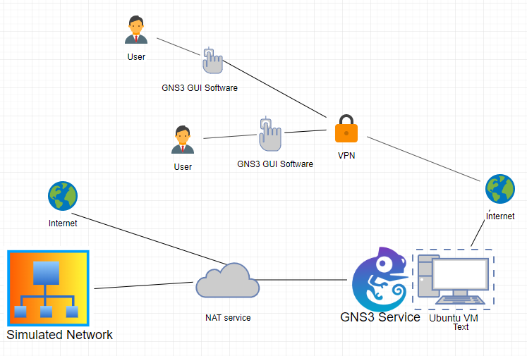

# NSM-Implementation

## Overview
Network security is a complex process involving a lot of different micro components that need to be fine tuned to orchestrate a smooth, fast , adaptive and scalable implementation. For an organization to have a hardened NSM model, it must go through thorough and rigorous designs, redesigns and reviews before arriving at an optimal implementation. The dynamic nature of the threat that a network faces adds to the challenge of the task at hand, and an organization must either outsource or have a dedicated team of professionals in this area who are continuously trained to maintain the NSM and modify it when the need be. The Application Collection Framework and Collective Intelligence frameworks are some which provide good reference points in setting up NSM for a given network. From deciding sensor hardware and placement, to deciding algorithms that detect threats faster, to building a scalable architecture that can adapt to changes well- A network security analyst is expected to know a vast array of skills proficiently.

This project is an advanced project done under the curriculum of NYU Tandon School of engineering. The purpose of this advanced project was to analyse the effort and resources required to setup a minimalist Network Security Monitoring Model and Incident response. The effectiveness of various tools available in the open-source domain are attempted to be analysed on the basis of the resource consumption, effectiveness and usefulness. Once the network was reasonably hardened, efforts to understand it’s response to some classical and improvised network attacks were also tested out. The full whitepaper-report for the NSM is here, which talks about the project in more depth
:>  

[Whitepaper.pdf]: Project%20Whitepaper.pdf

## Tools/Technologies used
1. Justniffer, Zeek for PTSR data extraction
2. YAF, SiLK (Cert NetSA tools) for flow collection and generation
3. GNS3 For Network Simulation
4. Security Onion as a reference Sensor
5. Bash scripts for various tasks such as monitoring, logging, and miscellaneous other automations
6. Filebeat for shipping logs
7. FRR as router software
8. Application Collection Framework /Collection Intelligence Framework as guidance
9. Logstash for centrally collecting and transferring logs
10. Elasticsearch for distributed storage of logs.
11. Kibana for visual analysis of logs.
12. Ansible for managing multiple nodes in the network
13. Python for automation.

## Implementation Architecture
For this implementation GNS3 was setup in a remote Ubuntu Machine. This remote version of GNS3 is also called the remote server version wherein GNS3 runs as a service directly on Ubuntu. It is worth noting that GNS3 is by no means a hypervisor, it is a mere simulation of starting qemu-imgs and simulating a network for this (virtualization being done by qemu). The GNS3 used here runs on an Ubuntu18.03 distro with 250 Gigs of RAM which are more than sufficient if we are simulating 50 device network . The routers, hubs and switches run on very low memory. For some basic device testing, Alpine Linux may be used which run on very little ROM and RAM. For larger machine qemu’s such as Kali or Security Onion there would be additional RAM requirement. The network inside GNS3 can be accessed by using a GNS3 software client provided by them. A typical GNS3 network can then be interacted with a GUI. This GUI is the means of interacting with the GNS3 simulated network. When the client is started for the first time, it must be configured to connect to the remote GNS3 client.

The remote GNS3 server (if setup) will ask for authentication credentials, but in a trusted private network or local versions may be avoided. The GNS3 client software (GUI) sees the remote server and machines running on it. Multiple clients may connect to this remote server, but it can run only 1 project at a time, and all connected clients make changes to this network which the other clients see reflect.
The screenshot below shows a typical setup of a GNS3 network with some of the appliances.

## Sensor Placement and Network Design
