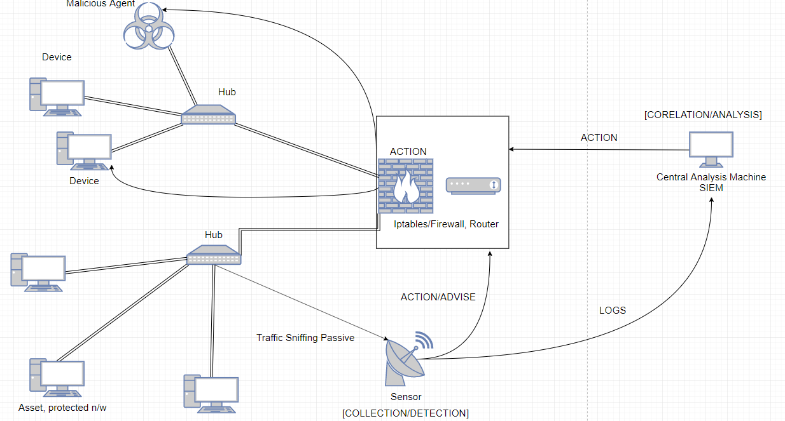
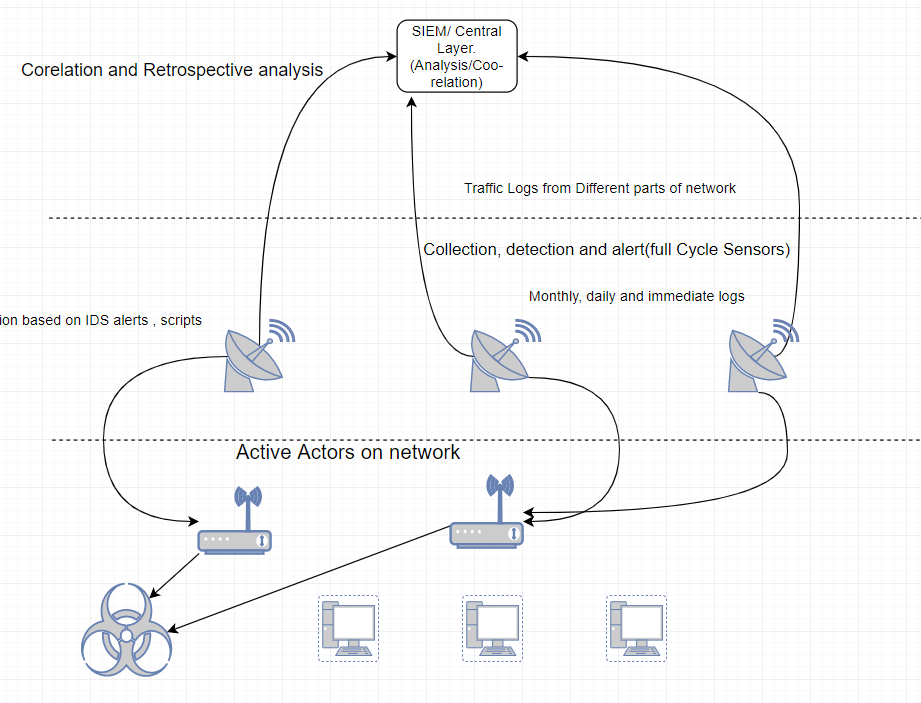
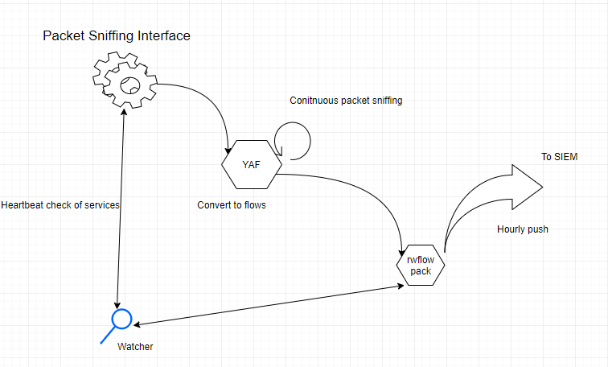
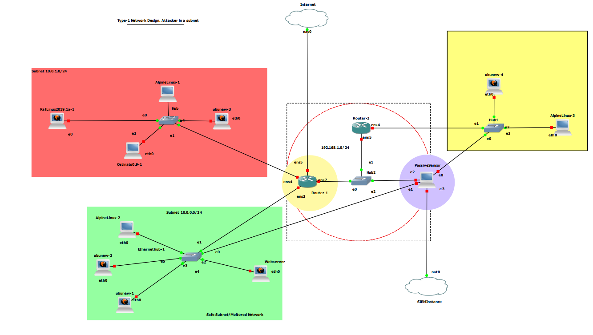
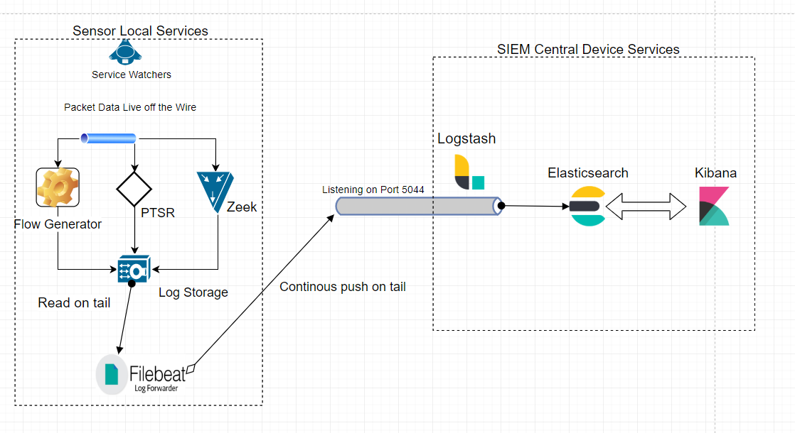
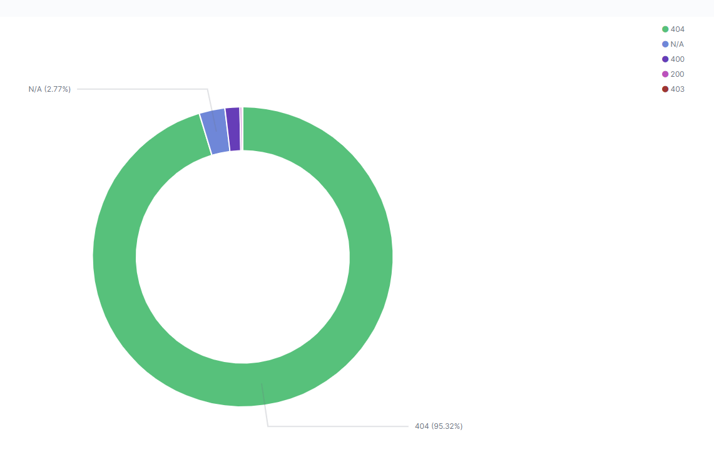
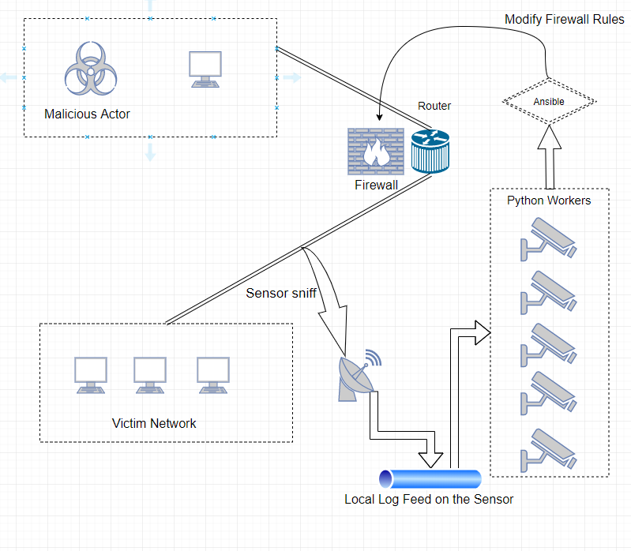

# NSM-Implementation

## Overview
Network security is a complex process involving a lot of different micro components that need to be fine tuned to orchestrate a smooth, fast , adaptive and scalable implementation. For an organization to have a hardened NSM model, it must go through thorough and rigorous designs, redesigns and reviews before arriving at an optimal implementation. The dynamic nature of the threat that a network faces adds to the challenge of the task at hand, and an organization must either outsource or have a dedicated team of professionals in this area who are continuously trained to maintain the NSM and modify it when the need be. The Application Collection Framework and Collective Intelligence frameworks are some which provide good reference points in setting up NSM for a given network. From deciding sensor hardware and placement, to deciding algorithms that detect threats faster, to building a scalable architecture that can adapt to changes well- A network security analyst is expected to know a vast array of skills proficiently.

This project is an advanced project done under the curriculum of NYU Tandon School of engineering. The purpose of this advanced project was to analyse the effort and resources required to setup a minimalist Network Security Monitoring Model and Incident response. The effectiveness of various tools available in the open-source domain are attempted to be analysed on the basis of the resource consumption, effectiveness and usefulness. Once the network was reasonably hardened, efforts to understand it’s response to some classical and improvised network attacks were also tested out. The full whitepaper-report for the NSM is here, which talks about the project in more depth
:>  [White paper](Project%20Whitepaper.pdf).

## Tools/Technologies used
1. Justniffer, Zeek for PTSR data extraction
2. YAF, SiLK (Cert NetSA tools) for flow collection and generation
3. GNS3 For Network Simulation
4. Security Onion as a reference Sensor
5. Bash scripts for various tasks such as monitoring, logging, and miscellaneous other automations
6. Filebeat for shipping logs
7. FRR as router software
8. Application Collection Framework /Collection Intelligence Framework as guidance
9. Logstash for centrally collecting and transferring logs
10. Elasticsearch for distributed storage of logs.
11. Kibana for visual analysis of logs.
12. Ansible for managing multiple nodes in the network
13. Python for automation.

## Implementation Architecture
For this implementation GNS3 was setup in a remote Ubuntu Machine. This remote version of GNS3 is also called the remote server version wherein GNS3 runs as a service directly on Ubuntu. It is worth noting that GNS3 is by no means a hypervisor, it is a mere simulation of starting qemu-imgs and simulating a network for this (virtualization being done by qemu). The GNS3 used here runs on an Ubuntu18.03 distro with 250 Gigs of RAM which are more than sufficient if we are simulating 50 device network . The routers, hubs and switches run on very low memory. For some basic device testing, Alpine Linux may be used which run on very little ROM and RAM. For larger machine qemu’s such as Kali or Security Onion there would be additional RAM requirement. The network inside GNS3 can be accessed by using a GNS3 software client provided by them. A typical GNS3 network can then be interacted with a GUI. This GUI is the means of interacting with the GNS3 simulated network. When the client is started for the first time, it must be configured to connect to the remote GNS3 client.

The remote GNS3 server (if setup) will ask for authentication credentials, but in a trusted private network or local versions may be avoided. The GNS3 client software (GUI) sees the remote server and machines running on it. Multiple clients may connect to this remote server, but it can run only 1 project at a time, and all connected clients make changes to this network which the other clients see reflect.
The screenshot below shows a typical setup of a GNS3 network with some of the appliances.

## Hierarchy and Control Flow

The SIEM is the place where all the logs are aggregated and kept for analysis and further retrospection. 
The important thing to note here is that sensors are always decoupled from the SIEM center. The sensors are tasked with sniffing on network traffic, and usually have resource extensive operations and hence they should be minimized with tasks. Anything which is not a part of data sniffing or conversion should not be run on the sensors directly. 
**It is also important to note that sensors are not active devices on the network**. They are by definition passive and hence they cannot directly "prevent" an attack by setting up firewalls on themselves, they need to convert these action items to alerts and instruct the routers to do this.
The image below shows a logical representation of the network.

The following diagram explains the abstraction of the planes and what constitutes them. Once these planes are clearly defined, their area of operations and interactions can be implemented. That is shown below.
In this NSM model, the sensors are Half cycle. A half cycle sensor majorly performs collection and detection. 
There is immediate analysis performed (events which do not require human intervention) using IDS sitting on the sensors, but the retrospective analysis is done on the SIEM machine which is centralized.
The logical grouping of the events look like this. 

# Phases of NSM

The process of NSM can be broadly subdivided into 3 processes that complement each other while existing on their own. They are Collection, Detection and Analysis. 

## Phase-1: Collection: 

The biggest and most challenging aspect of NSM is to perform Data Collection. The entirety of analysis and

detection and response sits on the foundation of data collection. When it comes to dealing with network data

we are faced with the traditional problem of Visibility vs Size. The quality of the network security monitoring

model and incident response hinders on the foundation of the quality of data being collected and analysed.

There are several forms in which data may be collected and stored. There are 3 major categories in which this

may be organized. These are :

• **FPC Data** Full packet data or packets as they are sniffed off the wire by pcap or packet libraries.

• **Flow Data**: This is a summary of conversation or data. The format depends on the flow generation

tools. These may be of the format of IPFix or the Cisco netflow.

• **Packet String Data** (PTSR): Size and detail wise these sit right between FPC and Flow Data (also

called Session Data). They are like application styled and have some granularity but not like FPC data.

**Flow Collection has been done using YAF, SiLK and CertNetSa set of tools.**

The logical analogy has been shown below. The collected data is sent to SIEM

The network was simulated in GNS3 and for this implementation there was 1 sensor monitoring a subnet and reporting the values to the central SIEM running instance. The GNS3 network design has been shown below.
The network uses FRR images, Kali Machines, Ostinato (for traffic simulation), Ubuntu Webservers.

The packet string data  is collected from **FPC ** data using **Justniffer** and **Zeek**.

The Data collection and storage architecture is setup using **Filebeat , Logstash, Elasticsearch** and **Kibana** which forms the foundation of the **Analysis phase** as well. The image below shows the architecture which was setup for collecting the logs, storing them and shipping them off. The sensor uses bash and cron to rotate logs, and ships every log with **Sensor id** , so that SIEM can identify the subnet and network information from the sensor id reported.

## Phase-2: Detection

The second phase of NSM , implemented using an orchestration of **Zeek**, **Flow Data Signature analysis** and Cron jobs that watch the health of these services. The detection is based on analysing **pcap files** of attacks and looking for patterns and signatures. These packets were taken from the website : [pcapanalysis.com][https://www.pcapanalysis.com]
These were then loaded up in Kibana to see patterns in signatures. These patterns were later used in the **Analysis** phase to look for signatures in attacks in real-time. The detection phase look for patterns in signatures based off programmed logic. *Most of these are elaborated in the Whitepaper, but one example has been illustrated below.*
**Eg: Web Scanning**: One of the major activities performed by threat actors in network looking to exploit web applications are scanning and mapping the web applications. The web scanning showed unmistakeable patterns of failed connections to successful connections skewered way outside normal behaviour. As shown below immensely high no of 404 represent suspicious behaviour 

The web scanning even the stealthiest one would be an easy outlier.

## Phase-3: Analysis

Once the events have been detected, the analysis phase decides what needs to be done with the events. This NSM implementation uses **Python and Ansible** to change iptables when a signature or malicious patterns are detected in the data which may be Flow or Packet String data.

The implementation uses python workers running in threads which are continuously monitoring the log feed in sensor for events. They have a list of router hosts which are network responders, these actors have their iptables changed to block the malicious actor. However, they could be just as easily be modified to do something complex like corelate the mac address from the DHCP table. The analysis implementation overview has been shown below.

